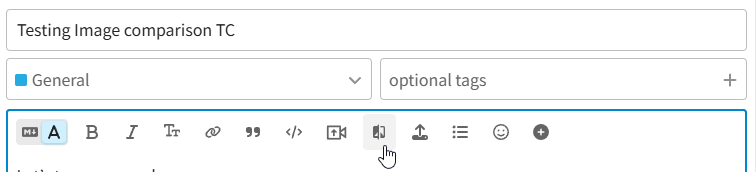
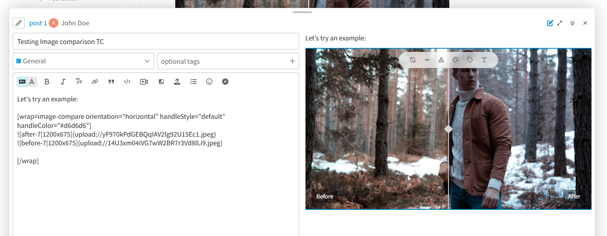
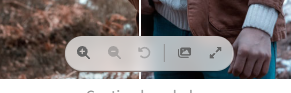

# Image Comparison Slider

A theme component for Discourse that turns two images into an interactive
before/after comparison slider that readers can drag to reveal each image.

For support and discussion, see the topic on Discourse Meta: https://meta.discourse.org/t/image-comparison-slider/264479

## Features

- Draggable before/after comparison, horizontal or vertical
- Zoom and pan (mouse wheel, pinch, and on-image controls)
- Fullscreen view with a smooth open/close animation
- Open the original, full-size images in the lightbox
- Optional before/after labels with configurable placement
- Optional caption
- Several handle styles (line, thin, circle, grabber) and a custom handle color
- Edit sliders directly in the rich text editor, or with markdown
- Keyboard accessible (arrow keys move the divider, `+`/`-`/`0` zoom)
- Restrict who can insert sliders by group

## Usage

In the composer, click the **Image comparison** button in the insert toolbar,
then add two images inside the inserted block. Or write the markup by hand:

The first image is the "before", the second is the "after". For the best
alignment, use two images with the same dimensions.

Per-slider options (orientation, divider position, handle style and color,
labels, and caption) are set from the toolbar that appears when the slider is
selected in the composer.

### Rich Text Editor

Here's a quick overview:

<video controls src="./.github/media/rte.mp4">
  Your browser does not support the video tag.
</video>

### Markdown

Similar to Rich Text Editor, the toolbar is available on markdown preview:

### Post View

When hover or click on the slider, the toolbar will appear:

You have access to the following options:

- Zoom controls: buttons and `-` `+` and `0` keyboard shortcuts
- Reset button to reset the slider to the default position
- Open the full-size images in the lightbox
- Enter fullscreen mode

## Settings

| Setting                  | Description                                                            |
| ------------------------ | ---------------------------------------------------------------------- |
| `allowed_groups`         | Groups allowed to insert a slider (group `everyone` = no restriction). |
| `default_orientation`    | Default slider orientation (horizontal or vertical).                   |
| `default_position`       | Default divider position (0–100).                                      |
| `default_handle_style`   | Default handle style.                                                  |
| `default_handle_color`   | Default handle color (empty uses the theme color).                     |
| `default_label_position` | Default label position.                                                |
| `default_show_labels`    | Show before/after labels by default.                                   |
| `enable_zoom`            | Allow readers to zoom and pan inside the slider.                       |
| `enable_lightbox`        | Show the button that opens the full-size images.                       |
| `enable_fullscreen`      | Show the fullscreen button.                                            |
| `max_zoom`               | Maximum zoom level (2–10).                                             |

## Compatibility

Requires Discourse 2026.6.0-latest or later.
